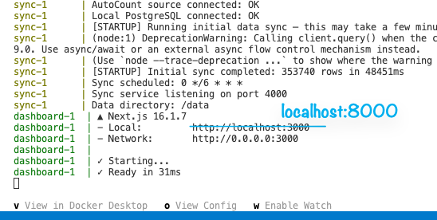

# Hoi-Yong Finance Dashboard

## You Need

- [Docker Desktop](https://www.docker.com/products/docker-desktop/) installed and running
- Credentials from Bitwarden (shared by Jason)

## Setup

**Step 1** — Clone this repo and go into the folder:

```bash
git clone https://github.com/jasonpaul-aqreight/HY-Finance-Demo.git
cd HY-Finance-Demo
```

**Step 2** — Switch to the demo branch:

```bash
git checkout demo/docker-handoff
```

**Step 3** — Copy the example file to create your `.env`:

```bash
cp .env.example .env
```

**Step 4** — Open `.env` and paste the 3 values from Bitwarden:

```
RDS_HOST=paste-host-here
RDS_USER=paste-username-here
RDS_PASSWORD=paste-password-here
```

**Step 5** — Start everything:

```bash
docker compose up --build
```

Wait 2-3 minutes for data to load. You'll know it's ready when you see `dashboard-1 | ✓ Ready` in the terminal:



Then open **http://localhost:8000**

## Stop

```bash
docker compose down
```

Your data is saved. Next time just run `docker compose up` again (no `--build` needed).

## Reset (start fresh)

```bash
docker compose down -v
docker compose up --build
```

This deletes all data and re-downloads everything from scratch.
