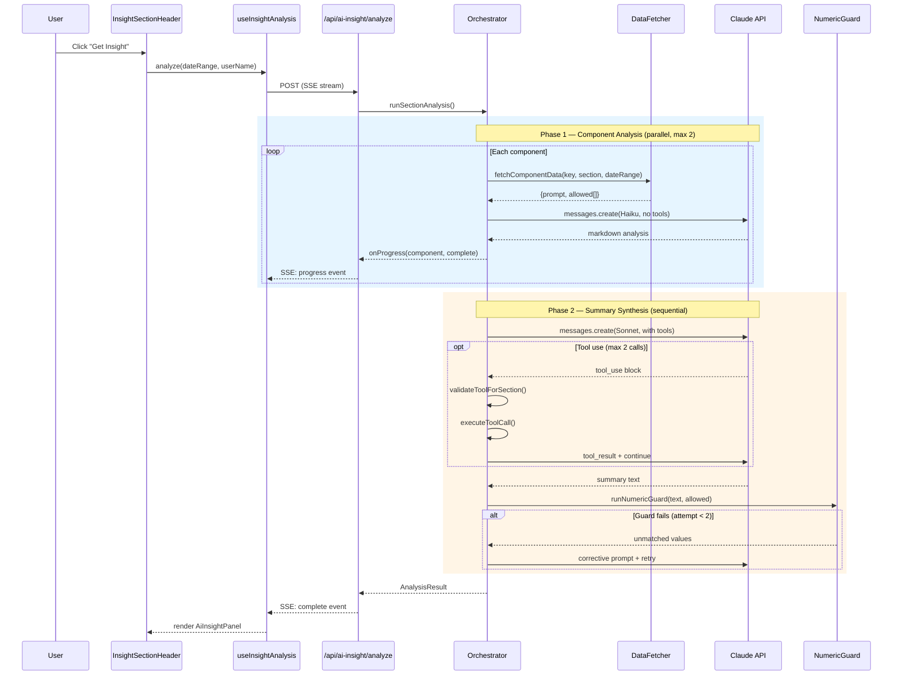
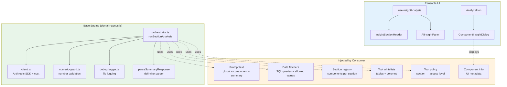
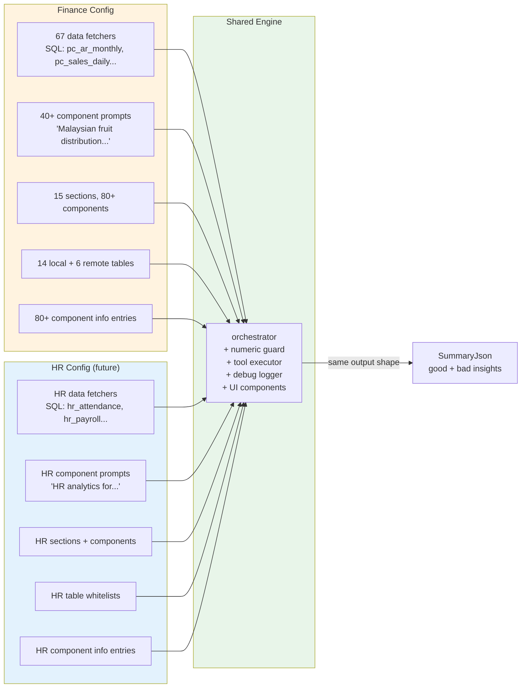

# AI Insight Engine — Architecture & Extraction Spec

**Purpose:** Document the current AI Insight Engine as-is, then define what is reusable (the "base") vs what is domain-specific (the "config"). This separation enables building a shared engine that works for Finance (current) and HR (future).

**Audience:** Developer extending the engine to new domains.

**Scope:** Runtime pipeline only — how data flows from user click to AI-generated text on screen. Does not cover database storage, locking, or concurrency control.

---

## 1. Runtime Pipeline Overview

The engine runs in two phases when a user triggers an insight:

1. **User clicks** "Get Insight" on a section header (or AnalyzeIcon on a single component)
2. **React hook** (`useInsightAnalysis`) sends a POST to `/api/ai-insight/analyze`
3. **API route** calls `runSectionAnalysis()` and streams progress via SSE
4. **Phase 1 — Component Analysis** (parallel, max 2 at a time):
   - For each component in the section:
     - `fetchComponentData()` runs SQL, returns formatted data + allowed numeric values
     - `buildComponentUserPrompt()` assembles the user message
     - `getComponentSystemPrompt()` returns global rules + component-specific instructions
     - Single Claude API call (Haiku, no tools) → markdown analysis
5. **Phase 2 — Summary Synthesis** (sequential, agentic):
   - All component results are fed into a summary prompt
   - Claude (Sonnet) can make up to 2 tool calls to drill into root causes
   - Numeric guard validates every number against a whitelist
   - Output: `SummaryJson` with `good[]` and `bad[]` insight cards
6. **SSE streams** progress back to the UI
7. **UI renders** insights in `AiInsightPanel` (section-level) or `ComponentInsightDialog` (component-level)

### Pipeline Sequence Diagram



---

## 2. File Map — Base vs Config

Every file in the AI Insight system, classified:

### Core Engine (`src/lib/ai-insight/`)

| File | Lines | Class | What it does |
|------|-------|-------|-------------|
| `orchestrator.ts` | ~560 | **Base** | Concurrency pool, agent loop, cost/time guard, rate-limit retry, response parser |
| `client.ts` | ~33 | **Base** | Anthropic SDK client singleton, model constants, cost estimation |
| `numeric-guard.ts` | ~183 | **Base** | Extracts numbers from AI text, validates against allowed whitelist |
| `debug-logger.ts` | ~250 | **Base** | Optional file-based debug logging (gated by env var) |
| `types.ts` | ~130 | **Mixed** | Core type contracts (base) + `PageKey`/`SectionKey` unions (config) |
| `tools.ts` | ~224 | **Mixed** | Tool executor + formatting (base) + table/column whitelists (config) |
| `tool-policy.ts` | ~83 | **Mixed** | Policy enforcement logic (base) + section→policy map (config) |
| `prompts.ts` | ~2058 | **Mixed** | Prompt builder functions (base) + all prompt text + section registries (config) |
| `data-fetcher.ts` | ~4007 | **Config** | 67 fetcher functions with SQL queries, scope map, scope label builder |
| `component-info.ts` | ~505 | **Config** | Static UI metadata (name, formula, indicator, about) per component |

### UI Components (`src/components/ai-insight/`)

| File | Class | What it does |
|------|-------|-------------|
| `InsightSectionHeader.tsx` | **Base** | Section-level trigger button + expandable panel container |
| `AiInsightPanel.tsx` | **Base** | Displays summary insights (good/bad cards), progress, metadata |
| `AnalyzeIcon.tsx` | **Base** | Component-level trigger button (magnifying glass icon) |
| `ComponentInsightDialog.tsx` | **Base** | Modal showing component analysis + "About" info |
| `InsightDetailDialog.tsx` | **Base** | Expanded view of a single insight card |
| `MarkdownRenderer.tsx` | **Base** | Renders AI markdown to styled HTML |

### Hooks (`src/hooks/ai-insight/`)

| File | Class | What it does |
|------|-------|-------------|
| `useInsightAnalysis.ts` | **Base** | State management, SSE streaming, cancel, refetch |

---

## 3. Mixed Files — Export-Level Breakdown

### `types.ts`

| Export | Class | Description |
|--------|-------|-------------|
| `PageKey` | Config | `'payment' \| 'sales' \| ...` — Finance-specific page names |
| `SectionKey` | Config | `'payment_collection_trend' \| ...` — Finance-specific section names |
| `ComponentType` | Base | `'kpi' \| 'chart' \| 'table' \| 'breakdown'` |
| `ComponentDef` | Base | `{key, name, type, sectionKey}` |
| `DateRange` | Base | `{start, end}` — calendar date scope |
| `FiscalPeriod` | Base | `{fiscalYear, range}` — fiscal year scope |
| `FetcherResult` | Base | `{prompt, allowed[]}` — what every data fetcher returns |
| `AllowedValue` | Base | `{label, value, unit?, tolerance?}` — numeric guard whitelist entry |
| `AllowedValueUnit` | Base | `'RM' \| 'pct' \| 'days' \| 'count'` |
| `ComponentResult` | Base | Per-component output: raw data + analysis + tokens |
| `SummaryJson` | Base | `{good[], bad[], numericGuard?}` — final output |
| `SummaryInsight` | Base | `{title, metric?, summary?, detail}` — one insight card |
| `AnalyzeRequest` | Mixed | Uses `PageKey` + `SectionKey` (would become `string` in base) |
| `SSE*` types | Base | SSE event types for streaming |

### `tools.ts`

| Export / Internal | Class | Description |
|-------------------|-------|-------------|
| `LOCAL_WHITELIST` | Config | 14 Finance-specific PostgreSQL tables + their allowed columns |
| `RDS_WHITELIST` | Config | 6 Finance-specific SQL Server tables + their allowed columns |
| `AI_TOOLS` | Config | Tool definitions with table names embedded in descriptions |
| `executeToolCall()` | Base | Routes to local or RDS query, returns markdown table |
| `validateColumns()` | Base | Checks columns against a whitelist (generic logic) |
| `executeLocalQuery()` | Mixed | Generic query execution but imports `getPool` directly |
| `executeRdsQuery()` | Mixed | Generic query execution but imports `queryRds` directly |
| `formatRowsAsTable()` | Base | Converts query rows to markdown table |
| `formatValue()` | Base | Null/date/number formatting |

### `tool-policy.ts`

| Export / Internal | Class | Description |
|-------------------|-------|-------------|
| `SECTION_POLICY` | Config | Maps 15 Finance section keys → `'none' \| 'aggregate_only' \| 'full'` |
| `AGGREGATE_LOCAL_TABLES` | Config | Set of 9 Finance-specific pre-aggregated table names |
| `policyForSection()` | Base | Looks up policy from a map (generic logic) |
| `toolsForSection()` | Base | Filters `AI_TOOLS` based on policy (generic logic) |
| `validateToolForSection()` | Base | Validates tool+table against policy (generic logic) |

### `prompts.ts`

| Export / Internal | Class | Description |
|-------------------|-------|-------------|
| `GLOBAL_SYSTEM` | Config | References "Malaysian fruit distribution company (Hoi-Yong)", RM currency |
| `COMPONENT_PROMPTS` | Config | 40+ Finance-specific per-component prompt entries |
| `SUMMARY_SYSTEM` | Config | References Hoi-Yong, lists Finance-specific tables/columns |
| `SECTION_COMPONENTS` | Config | Maps 15 sections → component arrays (Finance-specific) |
| `SECTION_PAGE` | Config | Maps 15 sections → page display names |
| `SECTION_NAMES` | Config | Maps 15 sections → section display names |
| `getGlobalSystemPrompt()` | Base | Returns the global system prompt (simple getter) |
| `getComponentSystemPrompt(key)` | Base | Combines global + component prompt (generic logic) |
| `getSummarySystemPrompt()` | Base | Returns summary system prompt (simple getter) |
| `buildComponentUserPrompt()` | Base | Assembles user prompt with date/scope info (generic template) |
| `buildSummaryUserPrompt()` | Base | Assembles summary prompt from component results (generic template) |

---

## 4. Base Layer — What the Shared Engine Provides

The base engine is everything that works regardless of whether you're analyzing Finance data, HR data, or anything else.

### Base Module Dependencies



### Function-Level Listing

**`orchestrator.ts` (all base)**
| Function | Signature | Purpose |
|----------|-----------|---------|
| `runSectionAnalysis` | `(sectionKey, dateRange, abortController, onProgress, fiscalPeriod?) → AnalysisResult` | Main entry point — runs both phases |
| `analyzeComponent` | `(componentKey, name, type, sectionKey, dateRange, abortSignal, logFile, fiscalPeriod?) → ComponentResult` | Single component: fetch data → prompt → Claude call |
| `runSummaryAnalysis` | `(sectionKey, dateRange, results, abortSignal, logFile, fiscalPeriod?) → SummaryJson + tokens` | Summary: agent loop + numeric guard |
| `runSummaryAgentLoop` | `(params: AgentLoopParams) → AgentLoopResult` | Inner multi-turn tool-use loop |
| `parseSummaryResponse` | `(textBlock, tokenCount, inputTokens, outputTokens) → {json: SummaryJson, ...}` | Parses `===INSIGHT===` delimiter format |
| `callWithRetry` | `(fn, abortSignal) → Anthropic.Message` | Retries on 429 with exponential backoff |

**Constants:** `MAX_CONCURRENCY=2`, `MAX_TOOL_CALLS_PER_SUMMARY=2`, `MAX_COST_PER_SECTION=$0.50`, `MAX_RUNTIME_MS=5min`, `SUMMARY_MAX_TOKENS=4096`, `RATE_LIMIT_RETRIES=3`

**`client.ts` (all base)**
| Function | Purpose |
|----------|---------|
| `getAnthropicClient()` | Singleton Anthropic SDK client |
| `estimateCost(inputTokens, outputTokens, model?)` | Token cost estimation |
| `AI_MODEL` | Component model (Haiku) |
| `SUMMARY_MODEL` | Summary model (Sonnet) |

**`numeric-guard.ts` (all base)**
| Function | Purpose |
|----------|---------|
| `extractNumbers(text)` | Finds all RM amounts, percentages, day counts, counts in text |
| `runNumericGuard(text, allowed)` | Checks every extracted number against the allowed whitelist |
| `formatGuardError(unmatched)` | Builds a corrective prompt listing rejected numbers |

**`debug-logger.ts` (all base)**
| Function | Purpose |
|----------|---------|
| `initDebugSession()` | Creates log file for this analysis run |
| `logComponentStart/End()` | Logs prompts and responses per component |
| `logSummaryStart/Response()` | Logs summary phase |
| `logToolResult()` | Logs tool call results |
| `logNumericGuard()` | Logs guard validation attempts |
| `logSessionEnd()` | Writes session summary (tokens, cost) |

**UI Components (all base)**
| Component | Props it needs | Purpose |
|-----------|---------------|---------|
| `InsightSectionHeader` | `page, sectionKey, dateRange, fiscalPeriod?` | Section trigger + expandable panel |
| `AiInsightPanel` | Fed by `useInsightAnalysis` hook | Renders good/bad insight cards, progress, metadata |
| `AnalyzeIcon` | `sectionKey, componentKey` | Small button on individual charts/KPIs |
| `ComponentInsightDialog` | `sectionKey, componentKey` | Modal with "About" + "AI Analysis" |
| `InsightDetailDialog` | A single `SummaryInsight` | Full detail view of one card |
| `MarkdownRenderer` | `markdown: string` | Renders markdown → styled HTML |

**Hook (base)**
| Hook | Returns |
|------|---------|
| `useInsightAnalysis(page, sectionKey)` | `{status, data, progress, error, analyze(), cancel(), refetch()}` |

---

## 5. Insight Config — What the Consumer Provides

When extending to a new domain (e.g. HR), the consumer provides all domain-specific data through a config object. Here are the interface contracts:

### Consumer Integration Pattern



### TypeScript Interface Contracts

```typescript
// ─── What the consumer provides ─────────────────────────────────────────────

/** Top-level config object — everything the engine needs from the consumer. */
interface InsightEngineConfig {
  // Section & component registry
  sections: Record<string, SectionDefinition>;
  sectionPages: Record<string, string>;       // section key → page display name
  sectionNames: Record<string, string>;       // section key → section display name

  // Prompts (all domain-specific text)
  globalSystemPrompt: string;                 // e.g. "You are a senior financial analyst..."
  summarySystemPrompt: string;                // e.g. "Produce a summary for Hoi-Yong..."
  componentPrompts: Record<string, string>;   // component key → specific instructions

  // Data layer
  dataFetchers: Record<string, DataFetcher>;  // component key → async function
  scopeMap: Record<string, ScopeType>;        // section key → 'period' | 'snapshot' | 'fiscal_period'

  // Tool access control
  toolWhitelists: {
    local: Record<string, string[]>;          // table name → allowed columns
    remote: Record<string, string[]>;         // table name → allowed columns
  };
  toolPolicy: Record<string, ToolPolicy>;     // section key → 'none' | 'aggregate_only' | 'full'
  aggregateOnlyTables: Set<string>;           // tables allowed under 'aggregate_only'

  // UI metadata
  componentInfo: Record<string, ComponentInfo>;

  // Database connectors (so the engine doesn't import Finance-specific DB clients)
  dbConnectors: {
    localQuery: (sql: string, params: unknown[]) => Promise<Record<string, unknown>[]>;
    remoteQuery: (sql: string, params: unknown[]) => Promise<Record<string, unknown>[]>;
  };
}

/** One section in the dashboard (e.g. "Payment Collection Trend"). */
interface SectionDefinition {
  key: string;
  page: string;                               // which page it belongs to
  name: string;                               // display name
  scope: 'period' | 'snapshot' | 'fiscal_period';
  components: ComponentDef[];                 // ordered list of components
  toolPolicy: 'none' | 'aggregate_only' | 'full';
}

/** One component within a section (e.g. "Avg Collection Days" KPI). */
interface ComponentDef {
  key: string;
  name: string;
  type: 'kpi' | 'chart' | 'table' | 'breakdown';
}

/** What every data fetcher returns. Already exists in types.ts. */
interface FetcherResult {
  prompt: string;          // formatted data block for the AI
  allowed: AllowedValue[]; // every number the AI is allowed to cite
}

/** Signature of a data fetcher function. */
type DataFetcher = (
  dateRange: DateRange | null,
  fiscalPeriod?: FiscalPeriod | null,
) => Promise<FetcherResult>;

/** Static UI metadata for a component. Already exists in component-info.ts. */
interface ComponentInfo {
  name: string;
  whatItMeasures: string;
  formula?: string;
  indicator?: string;
  about?: string;
}

// ─── What the base engine exports ───────────────────────────────────────────

/** Create an engine instance from consumer config. */
function createInsightEngine(config: InsightEngineConfig): {
  runSectionAnalysis: (
    sectionKey: string,
    dateRange: DateRange | null,
    abortController: AbortController,
    onProgress: ProgressCallback,
    fiscalPeriod?: FiscalPeriod | null,
  ) => Promise<AnalysisResult>;
};
```

### What Each Part Does (Plain English)

| Consumer Provides | Purpose | Example (Finance) |
|-------------------|---------|-------------------|
| `globalSystemPrompt` | Sets the AI's persona and rules | "You are a senior financial analyst for a Malaysian fruit distribution company..." |
| `summarySystemPrompt` | Instructions for synthesizing component results into insight cards | Ground truth rules, output format (`===INSIGHT===`), detail structure |
| `componentPrompts` | Per-component analysis instructions | "You are analyzing 'Avg Collection Days'. Threshold: ≤30 days = Good..." |
| `dataFetchers` | SQL queries that produce formatted data + allowed values | Queries `pc_ar_monthly`, computes DSO, returns markdown table |
| `sections` / `scopeMap` | What sections exist and how they scope data | 15 sections, scoped as period/snapshot/fiscal_period |
| `toolWhitelists` | Which tables and columns the AI can query at runtime | `pc_customer_margin: [month, debtor_code, ...]` |
| `toolPolicy` | Which sections can use tools and at what level | `payment_outstanding: 'full'`, `sales_trend: 'aggregate_only'` |
| `componentInfo` | Static display metadata for the UI "About" section | Name, formula, thresholds, explanation text |
| `dbConnectors` | How to run SQL queries | PostgreSQL pool query function, SQL Server query function |

---

## 6. Per-File Extraction Checklist

What moves to the base package vs what stays as Finance config:

### `types.ts`

| What | Action |
|------|--------|
| `PageKey`, `SectionKey` unions | **Stay in Finance config.** Base uses `string` instead. |
| `ComponentType`, `ComponentDef`, `DateRange`, `FiscalPeriod`, `FetcherResult`, `AllowedValue`, `AllowedValueUnit`, `ComponentResult`, `SummaryJson`, `SummaryInsight`, `NumericGuardReport`, `SSE*` types | **Move to base.** Already generic. |
| `AnalyzeRequest` | **Move to base** but change `page`/`section_key` from `PageKey`/`SectionKey` to `string`. |

### `tools.ts`

| What | Action |
|------|--------|
| `LOCAL_WHITELIST`, `RDS_WHITELIST` | **Stay in Finance config** → passed via `config.toolWhitelists` |
| `AI_TOOLS` array | **Rebuilt by base** from `config.toolWhitelists` (table names generated dynamically) |
| `executeToolCall()` | **Move to base** but parameterized: receives `dbConnectors` + whitelists from config instead of importing `getPool`/`queryRds` directly |
| `validateColumns()`, `formatRowsAsTable()`, `formatValue()` | **Move to base.** Already generic. |
| Snapshot dedup logic (`pc_ar_customer_snapshot`) | **Stay in Finance config.** This is a Finance-specific query pattern. Base provides a hook for custom query logic. |

### `tool-policy.ts`

| What | Action |
|------|--------|
| `SECTION_POLICY` map | **Stay in Finance config** → passed via `config.toolPolicy` |
| `AGGREGATE_LOCAL_TABLES` set | **Stay in Finance config** → passed via `config.aggregateOnlyTables` |
| `policyForSection()`, `toolsForSection()`, `validateToolForSection()` | **Move to base** but parameterized: reads from config instead of hardcoded maps |

### `prompts.ts`

| What | Action |
|------|--------|
| `GLOBAL_SYSTEM` | **Stay in Finance config** → passed via `config.globalSystemPrompt` |
| `SUMMARY_SYSTEM` | **Stay in Finance config** → passed via `config.summarySystemPrompt` |
| `COMPONENT_PROMPTS` | **Stay in Finance config** → passed via `config.componentPrompts` |
| `SECTION_COMPONENTS`, `SECTION_PAGE`, `SECTION_NAMES` | **Stay in Finance config** → passed via `config.sections`, `config.sectionPages`, `config.sectionNames` |
| `getComponentSystemPrompt(key)` | **Move to base.** Logic: `config.globalSystemPrompt + "\n\n" + config.componentPrompts[key]` |
| `getSummarySystemPrompt()` | **Move to base.** Logic: returns `config.summarySystemPrompt` |
| `buildComponentUserPrompt()` | **Move to base.** Already a generic template — just reads section name from config |
| `buildSummaryUserPrompt()` | **Move to base.** Already a generic template |

### `data-fetcher.ts`

| What | Action |
|------|--------|
| All 67 fetcher functions | **Stay in Finance config** → passed via `config.dataFetchers` |
| `SECTION_SCOPE` map | **Stay in Finance config** → passed via `config.scopeMap` |
| `fetchComponentData()` (the dispatcher) | **Move to base.** Logic: looks up scope from config, calls the right fetcher, prepends scope label |
| `buildScopeLabel()` | **Move to base.** Already generic — just needs scope type + date range |
| `rm()`, `pct()`, `days()`, `cnt()` helpers | **Move to base.** Utility functions for building `AllowedValue` arrays |

### `component-info.ts`

| What | Action |
|------|--------|
| `ComponentInfo` interface | **Move to base.** Already generic. |
| `COMPONENT_INFO` map (all entries) | **Stay in Finance config** → passed via `config.componentInfo` |

---

## 7. How HR Would Use the Base

The pattern is identical — HR provides different content through the same interface:

| What | Finance Provides | HR Would Provide |
|------|-----------------|-----------------|
| **Global system prompt** | "Senior financial analyst for Malaysian fruit distribution company (Hoi-Yong)" | "HR analytics specialist for [company name]" |
| **Sections** | 15 sections: Payment, Sales, Customer Margin, Supplier, Returns, Expenses, Financial | HR sections: Attendance, Payroll, Leave, Performance, Headcount |
| **Components** | 80+ (e.g. `avg_collection_days`, `cm_margin_trend`) | HR components (e.g. `attendance_rate`, `turnover_trend`) |
| **Data fetchers** | SQL against `pc_ar_monthly`, `pc_customer_margin`, etc. | SQL against HR tables (e.g. `hr_attendance`, `hr_payroll`) |
| **Component prompts** | "You are analyzing 'Avg Collection Days'. ≤30 days = Good..." | "You are analyzing 'Attendance Rate'. ≥95% = Good..." |
| **Tool whitelists** | 14 local + 6 remote Finance tables | HR-specific tables |
| **Tool policy** | `payment_outstanding: 'full'`, `sales_trend: 'aggregate_only'` | HR-specific section policies |
| **AllowedValueUnit** | `'RM' \| 'pct' \| 'days' \| 'count'` | May need new units (e.g. `'hours'`, `'headcount'`) |
| **DB connectors** | `getPool()` for PostgreSQL, `queryRds()` for SQL Server | HR database connectors |

**What stays exactly the same (base):**
- Orchestrator (concurrency, cost guard, timeout, rate limiting)
- Numeric guard (number extraction + whitelist matching)
- Summary response parser (`===INSIGHT===` format)
- Debug logging
- All UI components
- `useInsightAnalysis` hook
- SSE streaming
- `buildComponentUserPrompt()` / `buildSummaryUserPrompt()` templates

---

## 8. Hardcoded Coupling Points

These are the specific locations where Finance-specific values are hardcoded inside what should be base code. These must be resolved before extraction:

| # | File | Line(s) | What's Hardcoded | Fix |
|---|------|---------|-----------------|-----|
| 1 | `types.ts` | 3 | `PageKey` = 7 Finance page names | Change to `string` in base |
| 2 | `types.ts` | 5–20 | `SectionKey` = 15 Finance section keys | Change to `string` in base |
| 3 | `tools.ts` | 6–22 | `LOCAL_WHITELIST` = 14 Finance tables | Inject via config |
| 4 | `tools.ts` | 24–31 | `RDS_WHITELIST` = 6 Finance tables | Inject via config |
| 5 | `tools.ts` | 37–112 | `AI_TOOLS` descriptions embed Finance table names | Generate dynamically from config whitelists |
| 6 | `tools.ts` | 2 | `import { getPool, queryRds }` — direct DB imports | Inject via `config.dbConnectors` |
| 7 | `tools.ts` | 158–178 | `pc_ar_customer_snapshot` dedup logic | Move to Finance-specific fetcher or config hook |
| 8 | `tool-policy.ts` | 7–23 | `SECTION_POLICY` = 15 Finance entries | Inject via config |
| 9 | `tool-policy.ts` | 25–35 | `AGGREGATE_LOCAL_TABLES` = 9 Finance tables | Inject via config |
| 10 | `prompts.ts` | 5–40 | `GLOBAL_SYSTEM` references "Hoi-Yong", RM, Malaysian | Inject via config |
| 11 | `prompts.ts` | 44–1663 | `COMPONENT_PROMPTS` = 40+ Finance entries | Inject via config |
| 12 | `prompts.ts` | 1665–1832 | `SUMMARY_SYSTEM` references Hoi-Yong, Finance tables | Inject via config |
| 13 | `prompts.ts` | 1836–1937 | `SECTION_COMPONENTS` = 15 Finance section registries | Inject via config |
| 14 | `prompts.ts` | 1939–1973 | `SECTION_PAGE`, `SECTION_NAMES` = Finance mappings | Inject via config |
| 15 | `data-fetcher.ts` | 1–47 | Imports from Finance-specific query modules | Stay in Finance config |
| 16 | `data-fetcher.ts` | 67–3910 | All 67 fetcher functions | Stay in Finance config |
| 17 | `data-fetcher.ts` | 3916–3932 | `SECTION_SCOPE` = 15 Finance entries | Inject via config |
| 18 | `component-info.ts` | 15–504 | `COMPONENT_INFO` = 80+ Finance entries | Inject via config |

**Total: 18 coupling points across 5 files.**

The fix pattern is consistent: replace hardcoded values with config injection. The engine logic (orchestrator, guard, parser, UI) has zero coupling points — it's already domain-agnostic.
